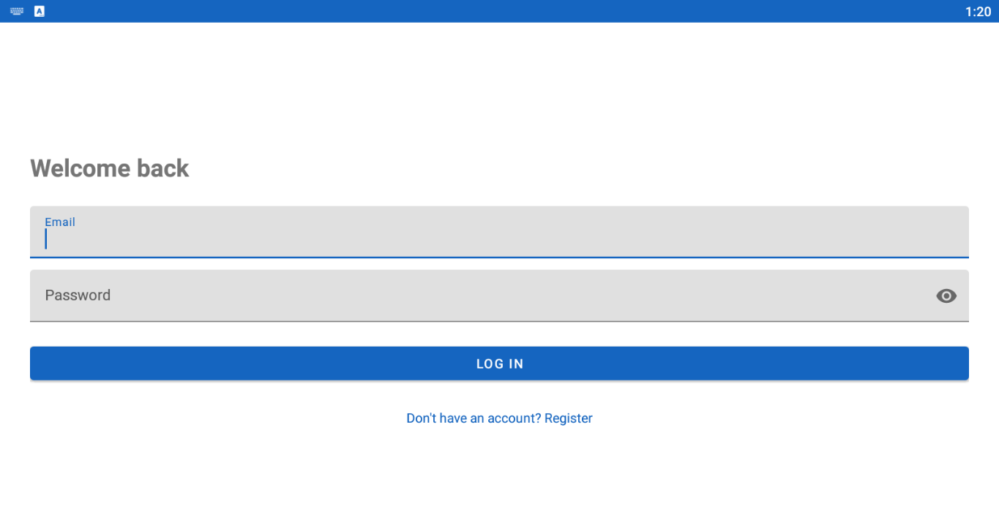
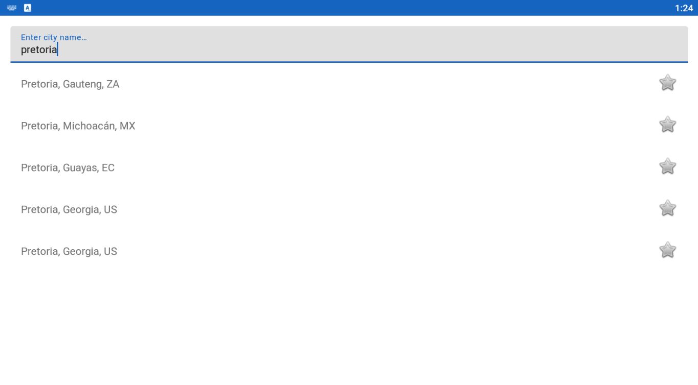
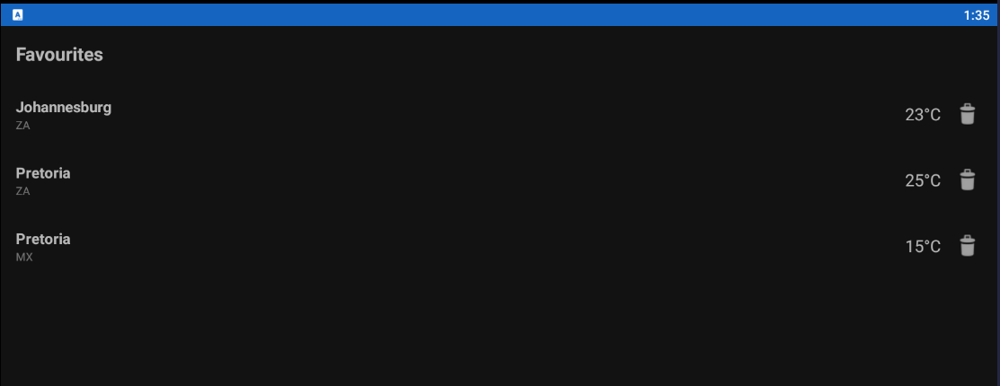
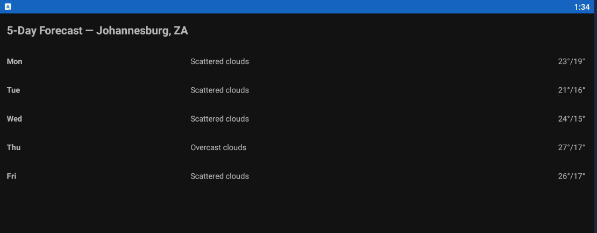
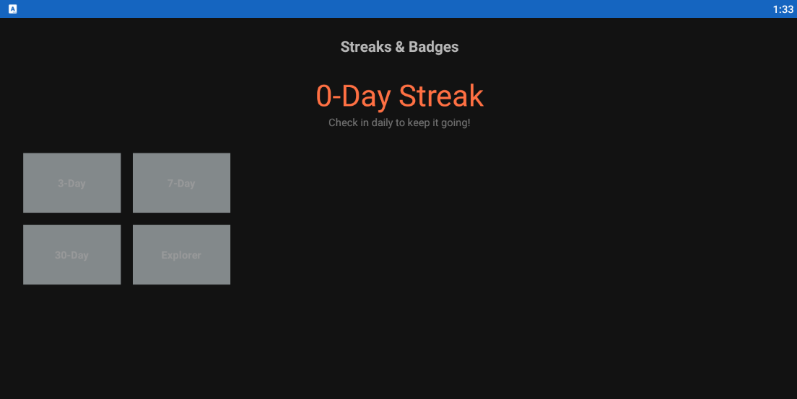
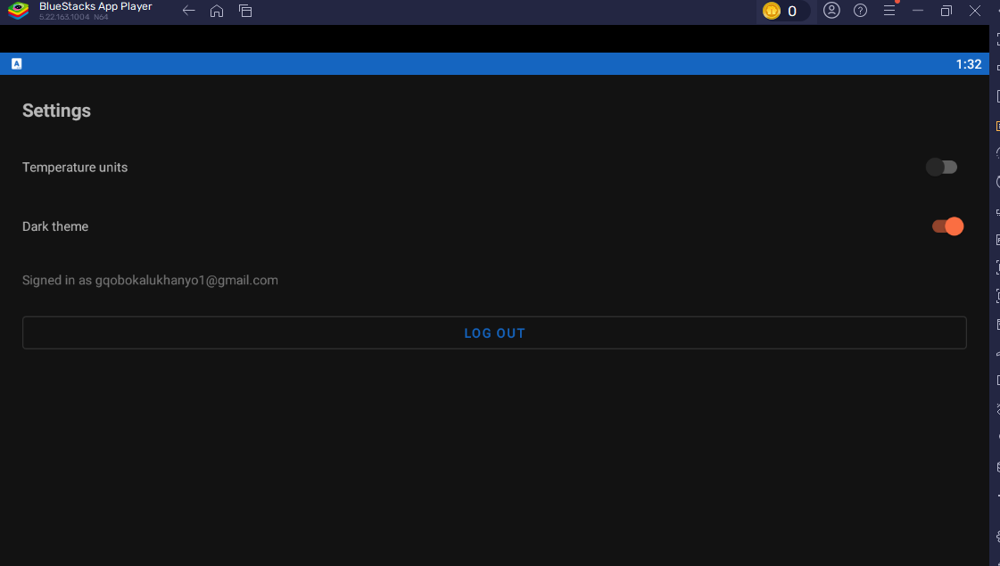
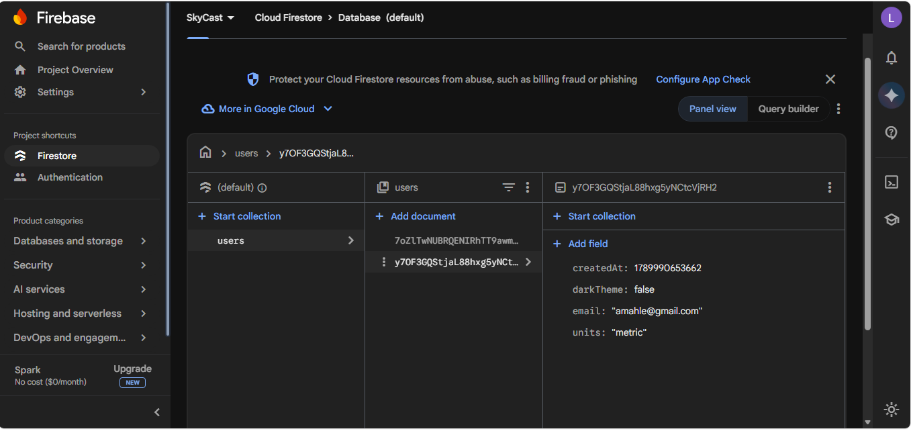
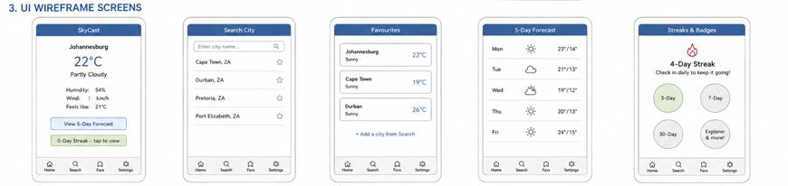
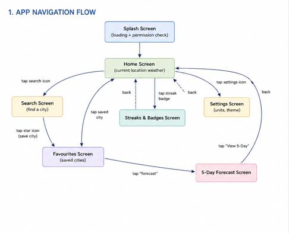
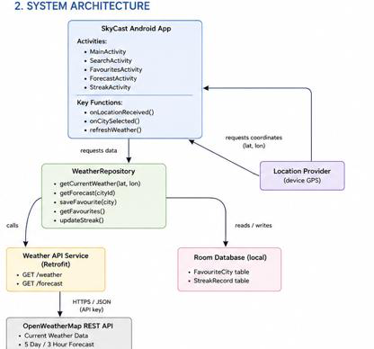

<p align="center">
  
</p>

<h1 align="center">SkyCast</h1>
<p align="center">A simple weather app for checking current conditions, a 5-day forecast, and saved cities — with a small daily streak game built in.</p>

---

## What it does

- Check current weather for a GPS location or any searched city
- Save favourite cities and see them all at a glance
- View a 5-day forecast
- Build a daily check-in streak and unlock badges (3-day, 7-day, 30-day, Explorer)
- Change units (°C/°F) and dark theme, synced to your account
- Register/log in with an email + password (via Firebase Auth)

## Screenshots

| | | |
|---|---|---|
|  |  |  |
|  |  |  |

## Backend

Registered accounts and per-user settings live in Firebase, viewable in the console:



- **Firebase Authentication** — email/password login. Passwords are salted & hashed by Firebase server-side; SkyCast's own code never sees or stores them.
- **Cloud Firestore** — stores each user's `units` and `darkTheme` preference, keyed by their account.
- **OpenWeatherMap REST API** — current weather, 5-day/3-hour forecast, and city geocoding.
- **Room (local SQLite)** — favourite cities and streak/badge progress, so they still work offline.

## Tech stack

Kotlin · Retrofit + Gson · Room · Firebase Auth & Firestore · Coroutines · Google Play Services Location · JUnit/Mockito

## Project structure

```
app/src/main/java/com/skycast/app/
├── ui/            one package per screen (auth, home, search, favourites, forecast, streak, settings)
├── data/remote/   Retrofit service + OpenWeatherMap response models
├── data/local/    Room entities, DAOs, database
├── data/repository/  the only layer the UI talks to
└── util/          pure, unit-tested logic (forecast day-aggregation, streak rules)
```

## Running it locally

1. Get a free API key from [openweathermap.org/api](https://openweathermap.org/api) and put it in `gradle.properties`:
   ```
   OPEN_WEATHER_API_KEY=your_key_here
   ```
2. Create a [Firebase project](https://console.firebase.google.com), register an Android app with package name `com.skycast.app`, enable **Authentication → Email/Password** and **Firestore Database**, then download `google-services.json` into the `app/` folder.
3. Open in Android Studio, sync, run.

## Testing

```
./gradlew test                  # ForecastAggregatorTest, StreakManagerTest
./gradlew connectedAndroidTest  # FavouriteCityDaoTest (needs a device/emulator)
```

## CI

`.github/workflows/android-ci.yml` runs the unit test suite automatically on every push/PR to `main`.

## Design notes

Built from the Part 1 planning document — original wireframes, navigation flow, and system architecture below.

<details>
<summary>Part 1 design diagrams</summary>





</details>

## Video demo

<video controls src="20260921150211.mp4" title="Title"></video>
