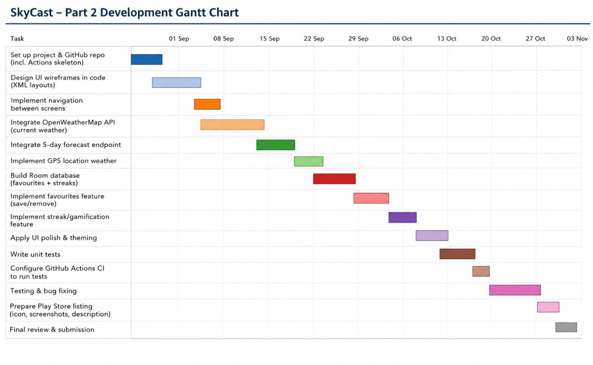

# SkyCast — Part 2 Prototype

A native Android (Kotlin) weather app that lets you check current conditions and a 5-day
forecast for your GPS location or any searched city, save favourite cities, and build up a
small daily check-in streak. This repository contains the working Part 2 prototype built on
top of the Part 1 planning & design document.


*Original Part 1 low-fidelity wireframes for the five core screens — the Part 2 prototype
implements this same screen set.*

---

## 1. App Purpose

SkyCast's goal is unchanged from Part 1: make it fast and simple to check the weather, for
more than one city, without accounts getting in the way of the *weather* features — while a
small, optional streak/badge system gives people a reason to open the app daily. Part 2 adds
the infrastructure a real product needs around that: authenticated accounts (so settings and
data aren't lost if the app is reinstalled), a hosted backend, and automated testing/CI.

## 2. Feature Checklist (Part 2 requirements → where they live)

| Requirement | Implementation |
|---|---|
| RESTful API in an Android app | `data/remote/WeatherApiService.kt` — Retrofit + Gson calls to OpenWeatherMap's Current Weather, 5-Day/3-Hour Forecast, and Geocoding endpoints. |
| External library solving a programming problem | Retrofit/OkHttp (networking), Gson (JSON parsing), Room (local persistence), Google Play Services Location (GPS). |
| Connect to an appropriate SDK | Firebase Authentication + Cloud Firestore SDK (`data/repository/AuthRepository.kt`, `UserSettingsRepository.kt`). |
| Detailed unit testing | `app/src/test/.../ForecastAggregatorTest.kt`, `StreakManagerTest.kt` (pure logic, JVM), plus `app/src/androidTest/.../FavouriteCityDaoTest.kt` (Room, on-device). |
| Registration & login with password encryption | `ui/auth/RegisterActivity.kt`, `LoginActivity.kt` via Firebase Auth — see §5 below for how encryption is handled. |
| Settings the user can change | `ui/settings/SettingsActivity.kt` — units (°C/°F) and dark theme, both synced to Firestore. |
| REST API + hosted database | OpenWeatherMap (REST) for weather data; Cloud Firestore (hosted online) for user accounts/settings. |
| Part 1 features carried over | Home (GPS current weather), Search, Favourites, 5-Day Forecast, Streaks & Badges, offline cache — see §4. |
| Crash-resilient, user-friendly UI | Every text input is validated before use (email format, password length/match, blank checks); network/GPS failures fall back to cached data instead of crashing; see §6. |

## 3. Design Considerations

### 3.1 Why Firebase for auth + hosted data
The brief allows "a custom-created [API] connected to a database, or any internet-hosted
storage/API." Rather than stand up and maintain a separate custom backend for a
semester-length project, SkyCast uses **Firebase Authentication** (encrypted, hosted account
storage) and **Cloud Firestore** (hosted NoSQL database) for user accounts and settings. This
was chosen because:
- It satisfies the "connect to an appropriate SDK" objective directly (the Firebase Android SDK).
- Password handling follows security best practice — SkyCast never implements its own password
  hashing/storage, which is exactly what security guidance recommends against doing yourself.
- It's genuinely internet-hosted (Google Cloud), inspectable via the Firebase Console for the
  video demonstration's "backend data view" requirement.
- It keeps the existing Part 1 local-Room design intact for weather-specific data (see below),
  so the Part 1 architecture didn't need to be thrown away — just extended.

### 3.2 What stayed local (Room) vs. what moved to the cloud (Firestore)
| Data | Where | Why |
|---|---|---|
| Favourite cities, streak count, badges | Room (on-device SQLite) | Per Part 1 §5/§6: this data belongs to the device/user, doesn't need cross-device sync for the MVP, and must still work offline (R8). |
| User account, units preference, theme preference | Firestore (hosted) | Needs to exist independently of any one device/install, and is what the Part 2 brief requires to be an internet-hosted store. |
| Live weather readings | Not persisted server-side | Fetched fresh from OpenWeatherMap each time; only the *last successful reading* is cached locally (`util/LastWeatherCache.kt`) for offline resilience. |

### 3.3 UI
Screens follow the Part 1 wireframes and navigation diagram directly (bottom navigation bar
added for quicker switching between Home / Search / Favourites / Settings, with Forecast and
Streaks reached from Home as in the original flow):


## 4. Part 1 Features Included in This Prototype

- **Home** — current conditions (temperature, humidity, wind, feels-like) for the device's GPS
  location, pull-to-refresh, offline banner + cached last reading when there's no connection.
- **Search** — debounced city-name search (OpenWeatherMap Geocoding), save any result as a
  favourite directly from the results list.
- **Favourites** — Room-backed list of saved cities with an at-a-glance cached temperature.
- **5-Day Forecast** — 3-hour readings aggregated into daily min/max via `ForecastAggregator`.
- **Streaks & Badges** — daily check-in streak, 3/7/30-day badges, Explorer badge at 5 favourites.
- **Settings** *(extended for Part 2)* — units + theme, now synced to the hosted Firestore backend.

## 5. Authentication & Password Encryption

Registration and login run through **Firebase Authentication's email/password provider**.
SkyCast's own code never sees or stores a raw password beyond the momentary text field value
needed to submit it over TLS to Firebase — Firebase's backend salts and hashes the password
(scrypt-based) before storing it. This means:
- There is no custom password column in any SkyCast database to accidentally leak in plaintext.
- The "backend data view" in the video demo can show the Firebase Console's **Authentication**
  tab (listing registered users, but never their passwords) and the **Firestore** tab (user
  settings documents), satisfying the requirement to show what's stored server-side.

## 6. Handling Invalid Input / Stability

- Login/Register: blank fields, malformed email addresses, short passwords, and
  mismatched confirm-password are all caught before any network call is made, with inline
  `TextInputLayout` error messages — no exceptions thrown.
- Search: an empty query short-circuits before hitting the network; failed searches (no
  connection, no results) show a message instead of an empty crash-prone screen.
- Home: if location permission is denied, or the GPS/API call fails (e.g. airplane mode), the
  app falls back to the last cached reading (`LastWeatherCache`) rather than crashing or
  showing a blank screen.
- Forecast: a missing/invalid city coordinate shows a friendly "forecast unavailable" message.

## 7. Architecture

Retained from Part 1, extended with the Auth/Firestore layer:


```
UI (Activities)  →  Repository layer  →  Retrofit (OpenWeatherMap) / Room (local) / Firebase (hosted)
```

- `data/remote` — Retrofit service + response models (OpenWeatherMap).
- `data/local` — Room entities/DAOs/database (favourites, streak).
- `data/repository` — the only layer Activities talk to; combines remote/local/cloud sources.
- `util` — pure, unit-testable logic (`ForecastAggregator`, `StreakManager`) plus small helpers.
- `ui/*` — one package per screen (auth, home, search, favourites, forecast, streak, settings).

## 8. Project Plan Reference

The original Part 1 Gantt chart guided this build:



## 9. Getting Started

### Prerequisites
- Android Studio (Koala or newer), JDK 17.
- A free [OpenWeatherMap API key](https://openweathermap.org/api).
- A [Firebase project](https://console.firebase.google.com/) with **Authentication**
  (Email/Password provider enabled) and **Cloud Firestore** turned on.

### Configuration (do this before building)
1. **OpenWeatherMap key** — open `gradle.properties` and replace
   `OPEN_WEATHER_API_KEY=PUT_YOUR_OPENWEATHERMAP_KEY_HERE` with your real key. This is read into
   `BuildConfig` at build time and is never committed with a real value (see `.gitignore` notes).
2. **Firebase config** — in the Firebase Console, register an Android app with package name
   `com.skycast.app`, download the generated `google-services.json`, and place it at
   `app/google-services.json` (a placeholder `app/google-services.json.example` shows the
   expected shape; the real file is git-ignored).
3. Sync Gradle and run on a physical device or emulator with Google Play services and location
   enabled.
4. **Gradle wrapper jar** — this repository ships `gradle/wrapper/gradle-wrapper.properties`
   (pinned to Gradle 8.7) but not the wrapper `.jar` binary itself. Opening the project in
   Android Studio will prompt you to generate/download it automatically on first sync. If you
   prefer the command line and already have Gradle installed, just run `gradle wrapper` once
   from the project root to create `gradlew`, `gradlew.bat`, and the jar before using
   `./gradlew ...` commands.

### Running tests locally
```bash
./gradlew test                 # JVM unit tests: ForecastAggregatorTest, StreakManagerTest
./gradlew connectedAndroidTest # Instrumented test: FavouriteCityDaoTest (needs a device/emulator)
```

## 10. GitHub & GitHub Actions

- All Kotlin source is committed directly to this repository (no ZIP uploads).
- **`.github/workflows/android-ci.yml`** runs automatically on every push/PR to `main`: it sets
  up JDK 17, installs a placeholder `google-services.json` (so the Google Services plugin has
  something to parse), and runs `./gradlew test`, uploading the JUnit report as a build
  artifact. This is what satisfies R10 from Part 1 ("GitHub Actions will be used to run the
  unit tests automatically... whenever changes are pushed or a pull request is made").
- To let CI (optionally) build against a real key, add a repository secret named
  `OPEN_WEATHER_API_KEY` under **Settings → Secrets and variables → Actions** — the workflow
  passes it through as `ORG_GRADLE_PROJECT_OPEN_WEATHER_API_KEY` automatically.

## 11. Logging

SkyCast uses Android's built-in `Log` class throughout (tag: `SkyCast`, see
`util/Constants.kt`) rather than `println`, at appropriate levels:
- `Log.d` for routine flow (API calls made, favourites saved/removed, streak updates).
- `Log.w` for recoverable problems (falling back to cache, a single favourite's temp refresh
  failing).
- `Log.e` for genuine failures (GPS/network errors), always with the exception attached.

This makes it straightforward to filter Logcat by tag during the video demonstration to show
the REST calls and database writes happening live.

## 12. Video Demonstration

📹 **Video link:** _[add your unlisted YouTube / OneDrive / Google Drive link here before submission]_

The video shows, on a physical device, with voice-over: registration and login (with a look at
the Firebase Authentication console confirming the encrypted/hashed record), changing a
setting in the Settings screen (with the updated Firestore document shown in the console),
searching for and saving a favourite city, the Home/Forecast screens pulling live data from
OpenWeatherMap, and the Streaks & Badges screen after a check-in.

## 13. References

- OpenWeatherMap (2026) *OpenWeatherMap API Documentation*. https://openweathermap.org/api
- Google (2026) *Room Persistence Library Documentation*. https://developer.android.com/training/data-storage/room
- Google (2026) *FusedLocationProviderClient Documentation*. https://developer.android.com/reference/com/google/android/gms/location/FusedLocationProviderClient
- Square Inc. (2026) *Retrofit Documentation*. https://square.github.io/retrofit/
- Google (2026) *Firebase Authentication Documentation*. https://firebase.google.com/docs/auth/android/password-auth
- Google (2026) *Cloud Firestore Documentation*. https://firebase.google.com/docs/firestore
- GitHub (2026) *GitHub Actions Documentation*. https://docs.github.com/en/actions
